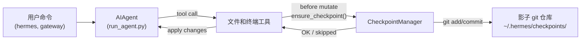

# 检查点和 `/rollback`

Hermes Agent 在**破坏性操作**之前自动快照您的项目，并允许您通过单个命令恢复它。检查点**默认启用** — 当没有文件修改工具触发时，没有任何成本。

这个安全网由内部的**检查点管理器**提供支持，该管理器在 `~/.hermes/checkpoints/` 下维护一个单独的影子 git 仓库 — 您的实际项目 `.git` 永远不会被触及。

## 什么会触发检查点

在以下操作之前会自动创建检查点：

- **文件工具** — `write_file` 和 `patch`
- **破坏性终端命令** — `rm`、`mv`、`sed -i`、`truncate`、`shred`、输出重定向 (`>`) 以及 `git reset`/`clean`/`checkout`

代理在**每回合每个目录最多创建一个检查点**，因此长时间运行的会话不会生成过多的快照。

## 快速参考

| 命令 | 描述 |
|------|------|
| `/rollback` | 列出所有检查点及其变更统计信息 |
| `/rollback <N>` | 恢复到检查点 N（同时撤销最后一个聊天回合） |
| `/rollback diff <N>` | 预览检查点 N 与当前状态之间的差异 |
| `/rollback <N> <file>` | 从检查点 N 恢复单个文件 |

## 检查点如何工作

从高层次来看：

- Hermes 检测工具何时将要**修改**您工作树中的文件。
- 在每个对话回合（每个目录）中，它：
  - 为文件解析合理的项目根目录。
  - 初始化或重用与该目录关联的**影子 git 仓库**。
  - 以简短的、人类可读的原因暂存并提交当前状态。
- 这些提交形成一个检查点历史，您可以通过 `/rollback` 检查和恢复。



## 配置

检查点默认启用。在 `~/.hermes/config.yaml` 中配置：

```yaml
checkpoints:
  enabled: true          # 主开关（默认：true）
  max_snapshots: 50      # 每个目录的最大检查点数
```

要禁用：

```yaml
checkpoints:
  enabled: false
```

禁用时，检查点管理器是一个无操作的组件，永远不会尝试 git 操作。

## 列出检查点

在 CLI 会话中：

```
/rollback
```

Hermes 会响应一个格式化的列表，显示变更统计信息：

```text
📸 Checkpoints for /path/to/project:

  1. 4270a8c  2026-03-16 04:36  before patch  (1 file, +1/-0)
  2. eaf4c1f  2026-03-16 04:35  before write_file
  3. b3f9d2e  2026-03-16 04:34  before terminal: sed -i s/old/new/ config.py  (1 file, +1/-1)

  /rollback <N>             restore to checkpoint N
  /rollback diff <N>        preview changes since checkpoint N
  /rollback <N> <file>      restore a single file from checkpoint N
```

每个条目显示：

- 短哈希值
- 时间戳
- 原因（触发快照的原因）
- 变更摘要（更改的文件、插入/删除）

## 使用 `/rollback diff` 预览变更

在提交恢复之前，预览自检查点以来发生的变化：

```
/rollback diff 1
```

这会显示 git diff 统计摘要，然后是实际的差异：

```text
test.py | 2 +-
 1 file changed, 1 insertion(+), 1 deletion(-)

diff --git a/test.py b/test.py
--- a/test.py
+++ b/test.py
@@ -1 +1 @@
-print('original content')
+print('modified content')
```

长差异会限制在 80 行以内，以避免淹没终端。

## 使用 `/rollback` 恢复

按编号恢复到检查点：

```
/rollback 1
```

在后台，Hermes：

1. 验证目标提交是否存在于影子仓库中。
2. 对当前状态进行**回滚前快照**，以便您以后可以"撤销撤销"。
3. 恢复工作目录中的跟踪文件。
4. **撤销最后一个对话回合**，使代理的上下文与恢复的文件系统状态匹配。

成功时：

```text
✅ Restored to checkpoint 4270a8c5: before patch
A pre-rollback snapshot was saved automatically.
(^_^)b Undid 4 message(s). Removed: "Now update test.py to ..."
  4 message(s) remaining in history.
  Chat turn undone to match restored file state.
```

对话撤销确保代理不会"记住"已回滚的更改，避免下一回合的混淆。

## 单文件恢复

从检查点恢复单个文件，而不影响目录的其余部分：

```
/rollback 1 src/broken_file.py
```

当代理对多个文件进行了更改但只需要恢复一个文件时，这很有用。

## 安全和性能保护

为了保持检查点的安全和快速，Hermes 应用了几个防护措施：

- **Git 可用性** — 如果在 `PATH` 上找不到 `git`，检查点会被透明禁用。
- **目录范围** — Hermes 跳过过于广泛的目录（根目录 `/`、主目录 `$HOME`）。
- **仓库大小** — 跳过包含超过 50,000 个文件的目录，以避免缓慢的 git 操作。
- **无变更快照** — 如果自上次快照以来没有变更，则跳过检查点。
- **非致命错误** — 检查点管理器内的所有错误都以调试级别记录；您的工具继续运行。

## 检查点存储位置

所有影子仓库都位于：

```text
~/.hermes/checkpoints/
  ├── <hash1>/   # 一个工作目录的影子 git 仓库
  ├── <hash2>/
  └── ...
```

每个 `<hash>` 派生自工作目录的绝对路径。在每个影子仓库中，您会找到：

- 标准 git 内部文件（`HEAD`、`refs/`、`objects/`）
- 包含精选忽略列表的 `info/exclude` 文件
- 指向原始项目根目录的 `HERMES_WORKDIR` 文件

您通常不需要手动触摸这些文件。

## 最佳实践

- **保持检查点启用** — 它们默认开启，当没有文件被修改时没有任何成本。
- **在恢复前使用 `/rollback diff`** — 预览将发生的变化，以选择正确的检查点。
- **当您只想撤销代理驱动的更改时，使用 `/rollback` 而不是 `git reset`**。
- **与 Git worktrees 结合使用以获得最大安全性** — 将每个 Hermes 会话保存在其自己的 worktree/分支中，以检查点作为额外层。

有关在同一仓库上并行运行多个代理的信息，请参阅 [Git worktrees](./git-worktrees.md) 指南。