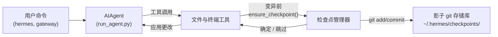

# 检查点和 `/rollback`

Hermes Agent 在**破坏性操作**之前自动快照你的项目，并让你通过单个命令恢复它。检查点默认**启用** —— 当没有文件变异工具触发时，零成本。

此安全网由内部**检查点管理器**提供支持，该管理器在 `~/.hermes/checkpoints/` 下保留一个单独的影子 git 存储库 —— 你的真实项目 `.git` 永远不会被触及。

## 什么触发检查点

检查点会在以下情况之前自动拍摄：

- **文件工具** —— `write_file` 和 `patch`
- **破坏性终端命令** —— `rm`、`mv`、`sed -i`、`truncate`、`shred`、输出重定向（`>`）和 `git reset`/`clean`/`checkout`

代理**每回合每个目录最多创建一个检查点**，因此长时间运行的会话不会生成大量快照。

## 快速参考

| 命令 | 描述 |
|---------|-------------|
| `/rollback` | 列出所有检查点及其更改统计信息 |
| `/rollback <N>` | 恢复到检查点 N（也撤消最后一个聊天回合） |
| `/rollback diff <N>` | 预览检查点 N 与当前状态之间的差异 |
| `/rollback <N> <file>` | 从检查点 N 恢复单个文件 |

## 检查点如何工作

在高层：

- Hermes 检测到工具即将**修改**你工作树中的文件时。
- 每回合（每个目录）一次，它：
  - 为文件解析一个合理的项目根目录。
  - 初始化或重用与该目录关联的**影子 git 存储库**。
  - 使用简短的人类可读原因暂存并提交当前状态。
- 这些提交形成一个检查点历史记录，你可以通过 `/rollback` 检查和恢复。



## 配置

检查点默认启用。在 `~/.hermes/config.yaml` 中配置：

```yaml
checkpoints:
  enabled: true          # 主开关（默认：true）
  max_snapshots: 50      # 每个目录的最大检查点数
```

要禁用：

```yaml
checkpoints:
  enabled: false
```

禁用时，检查点管理器是一个空操作，永远不会尝试 git 操作。

## 列出检查点

从 CLI 会话：

```
/rollback
```

Hermes 会用一个格式化的列表回复，显示更改统计信息：

```text
📸 /path/to/project 的检查点：

  1. 4270a8c  2026-03-16 04:36  before patch  (1 file, +1/-0)
  2. eaf4c1f  2026-03-16 04:35  before write_file
  3. b3f9d2e  2026-03-16 04:34  before terminal: sed -i s/old/new/ config.py  (1 file, +1/-1)

  /rollback <N>             恢复到检查点 N
  /rollback diff <N>        预览自检查点 N 以来的更改
  /rollback <N> <file>      从检查点 N 恢复单个文件
```

每个条目显示：

- 短哈希
- 时间戳
- 原因（什么触发了快照）
- 更改摘要（更改的文件、插入/删除）

## 使用 `/rollback diff` 预览更改

在承诺恢复之前，预览自检查点以来的更改：

```
/rollback diff 1
```

这会显示一个 git diff 统计摘要，后跟实际差异：

```text
test.py | 2 +-
 1 file changed, 1 insertion(+), 1 deletion(-)

diff --git a/test.py b/test.py
--- a/test.py
+++ b/test.py
@@ -1 +1 @@
-print('original content')
+print('modified content')
```

长差异限制为 80 行以避免淹没终端。

## 使用 `/rollback` 恢复

按编号恢复到检查点：

```
/rollback 1
```

在幕后，Hermes：

1. 验证目标提交存在于影子存储库中。
2. 拍摄当前状态的**回滚前快照**，以便你以后可以“撤消撤消”。
3. 恢复工作目录中被跟踪的文件。
4. **撤消最后一个聊天回合**，以便代理的上下文与恢复的文件系统状态匹配。

成功时：

```text
✅ 已恢复到检查点 4270a8c5：before patch
回滚前快照已自动保存。
(^_^)b 撤消了 4 条消息。已删除："Now update test.py to ..."
  历史记录中剩余 4 条消息。
  聊天回合已撤消以匹配恢复的文件状态。
```

聊天撤消确保代理不会“记住”已回滚的更改，从而避免下一回合出现混淆。

## 单文件恢复

从检查点仅恢复一个文件，而不影响目录的其余部分：

```
/rollback 1 src/broken_file.py
```

当代理对多个文件进行了更改但只需要还原一个时，这很有用。

## 安全与性能防护

为了保持检查点安全和快速，Hermes 应用了几个防护栏：

- **Git 可用性** —— 如果在 `PATH` 上找不到 `git`，检查点会被透明地禁用。
- **目录范围** —— Hermes 跳过过于宽泛的目录（根 `/`、家目录 `$HOME`）。
- **存储库大小** —— 具有超过 50,000 个文件的目录会被跳过以避免缓慢的 git 操作。
- **无更改快照** —— 如果自上次快照以来没有更改，则跳过检查点。
- **非致命错误** —— 检查点管理器内的所有错误都以调试级别记录；你的工具继续运行。

## 检查点位于何处

所有影子存储库都位于：

```text
~/.hermes/checkpoints/
  ├── <hash1>/   # 一个工作目录的影子 git 存储库
  ├── <hash2>/
  └── ...
```

每个 `<hash>` 都派生自工作目录的绝对路径。在每个影子存储库中，你会发现：

- 标准 git 内部结构（`HEAD`、`refs/`、`objects/`）
- 一个包含精心策划的忽略列表的 `info/exclude` 文件
- 一个指向原始项目根目录的 `HERMES_WORKDIR` 文件

你通常永远不需要手动触摸这些。

## 最佳实践

- **保持检查点启用** —— 它们默认开启，并且在没有文件被修改时零成本。
- **在恢复前使用 `/rollback diff`** —— 预览将要更改的内容以选择正确的检查点。
- **当你只想撤消代理驱动的更改时，使用 `/rollback` 而不是 `git reset`**。
- **与 Git 工作树结合使用以获得最大安全性** —— 将每个 Hermes 会话保存在自己的工作树/分支中，并将检查点作为额外层。

要在同一个存储库上并行运行多个代理，请参阅 [Git 工作树](./git-worktrees.md) 指南。
